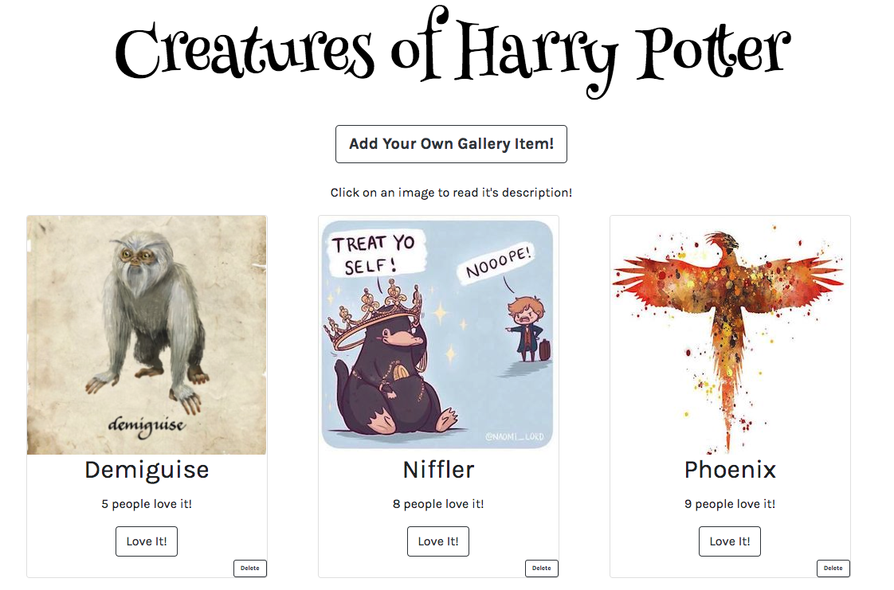

# Gallery App

This gallery app is designed to function around the theme "Creatures of Harry Potter". The user has the ability to add a new creature to the gallery via the "Add Your Own Gallery Item". When this button is clicked, a form appears that asks the user to input a title, image URL and image description. Once the item is added, the new gallery item is added to the gallery list and the user can toggle back to the gallery by clicking "Show Gallery!" . Other users can "Love" the gallery item by clicking the "Love It!" button which will increment the "people love it" count. In addition, to view the description of each gallery image, a user simply clicks on the image to show it's corresponding description. Users also have the ability to delete a gallery item. 

## Built With

- HTML
- Javascript
- React
- CSS
- Bootstrap
- Axios
- Express
- Node
- Postico
- Postgres
- Postman

## Getting Started

These instructions will get you a copy of the project up and running on your local machine for development and testing purposes. See deployment for notes on how to deploy the project on a live system.

### Prerequisites

- [Node.js](https://nodejs.org/en/)
- [React] (https://reactjs.org/)
- [Postico](https://eggerapps.at/postico/)
- [Postman] (https://www.getpostman.com/)

### Installing

1. Download this project.
2. `npm init -y`
3. `npm install express pg axios bootstrap`
4. Have Postico database running via Postgres
5. Check Package.json for the following dependencies:
    - axios
    - express
    - bootstrap
    - express
    - pg
    - react
    - react-dom
    - react-scripts

## Screen Shot

### Completed Features
- [x] Create Database to store items
- [x] Create GalleryList to "break apart data"
- [x] Create GalleryItem to display all items on DOM
- [x] Toggle between image and description on click (conditional rendering)
- [x] Create Love It button with incrementation on click
- [x] Axios GET/POST/PUT/DELETE requests
- [x] Create form with inputs and submit to add new item
- [x] Toggle between form and gallery
- [x] Styling via BootStrap and CSS
- [x] Componentize GalleryList, GalleryItem, and Form

### Next Steps

- [ ] Implement Uppy for Image Upload
- [ ] Ability for user to create own gallery theme 
    - Change Header and corresponding themed items
- [ ] Implement Material-UI grid layout to help with flex-start and space-evenly (will automatically align new item left and fix single items as being display in center) 

## Deployment

Deployed via Heroku

## Sources
The following websites were used for images as well as descriptions:

Websites for information 
- https://harrypotter.fandom.com/wiki/Norwegian_Ridgeback
- https://www.goodreads.com/author/quotes/1077326.J_K_Rowling
- https://www.pottermore.com/explore-the-story/house-elves
- https://www.hp-lexicon.org/creature/horse/hippogriff/ 

Images
- https://www.queeky.com/cms/gallery/image/dementor-unfinish
- https://fineartamerica.com/products/fawkes-monn-print-art-print.html
- https://i.pinimg.com/originals/46/57/55/46575511b583b97a2516e835e742d411.jpg
- https://i.pinimg.com/originals/95/be/b8/95beb85dbb51fd4df424e10cf1250dc4.jpg
- https://i.pinimg.com/originals/c8/5a/75/c85a753da37f1ac98f41a94027109170.jpg
- https://images-na.ssl-images-amazon.com/images/I/7104%2BriI%2BkL._SY450_.jpg
- https://images.pottermore.com/bxd3o8b291gf/3T7KHIYat2q48Cgq60iwEk/90998789eb10bb57c41b24db3b7c5966/Norbert_WB_F1_ConceptOfAYoungNorbert_Illust_080615_.LandTIF.jpg?w=1200

## Authors

Lili Bourgeois
# react-gallery-items
